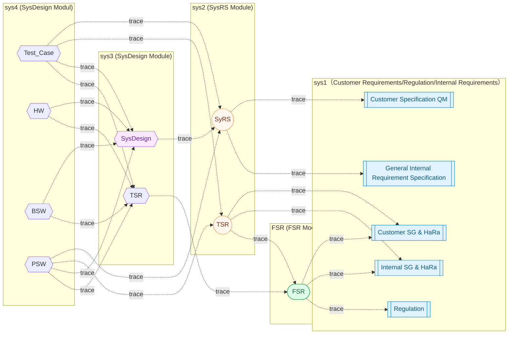

```mermaid
flowchart LR
  %% 四列泳道：sys1 / FSR / sys2 / sys3
  subgraph L1["sys1（Customer Requirements/Regulation/Internal Requirements）"]
    CR_QM[[Customer Specification QM]]
    CR_Safety[[Customer SG & HaRa]]
    REG[[Regulation]]
    Internal_QM[[General Internal Requirement Specification]]
    Internal_Safety[[Internal SG & HaRa]]
  end

  subgraph L2["FSR (FSR Module)"]
    FSR([FSR])
  end

  subgraph L3["sys2 (SysRS Module)"]
    sys2_QM((SyRS))
    sys2_TSR((TSR))
  end

  subgraph L4["sys3 (SysDesign Module)"]
    sys3_QM{{SysDesign}}
    sys3_TSR{{TSR}}
  end

  subgraph L5["sys4 (SysDesign Modul)"]
    Test_Case{{Test_Case}}
    HW{{HW}}
    BSW{{BSW}}
    PSW{{PSW}}
  end

  %% 追溯：FSR -> sys1
  FSR -. trace .-> CR_Safety
  FSR -. trace .-> Internal_Safety
  FSR -. trace .-> REG

  %% 追溯：sys2 -> sys1 / FSR
  sys2_QM -. trace .-> CR_QM
  sys2_QM -. trace .-> Internal_QM
  sys2_TSR -. trace .-> CR_Safety
  sys2_TSR -. trace .-> Internal_Safety
  sys2_TSR -. trace .-> FSR

  %% 追溯：sys3 -> sys2
  sys3_QM -. trace .-> sys2_QM
  sys3_TSR -. trace .-> FSR


  %% 追溯：sys4 -> sys2/3
  Test_Case -. trace .-> sys2_QM
  Test_Case -. trace .-> sys2_TSR
  Test_Case -. trace .-> sys3_QM
  Test_Case -. trace .-> sys3_TSR
  HW -. trace .-> sys3_QM
  HW -. trace .-> sys3_TSR
  BSW -. trace .-> sys3_QM
  BSW -. trace .-> sys3_TSR   
  PSW -. trace .-> sys2_QM
  PSW -. trace .-> sys2_TSR
  PSW -. trace .-> sys3_QM
  PSW -. trace .-> sys3_TSR 


  %% 上色：按层级
  classDef s1 fill:#e0f2fe,stroke:#0284c7,color:#075985
  classDef s2 fill:#dcfce7,stroke:#16a34a,color:#166534
  classDef s3 fill:#fff7ed,stroke:#fb923c,color:#7c2d12
  classDef s4 fill:#fae8ff,stroke:#a855f7,color:#6b21a8

  class CR_QM,CR_Safety,REG,Internal_QM,Internal_Safety s1
  class FSR s2
  class sys2_QM,sys2_TSR s3
  class sys3_QM,sys3_Safety s4 
```
