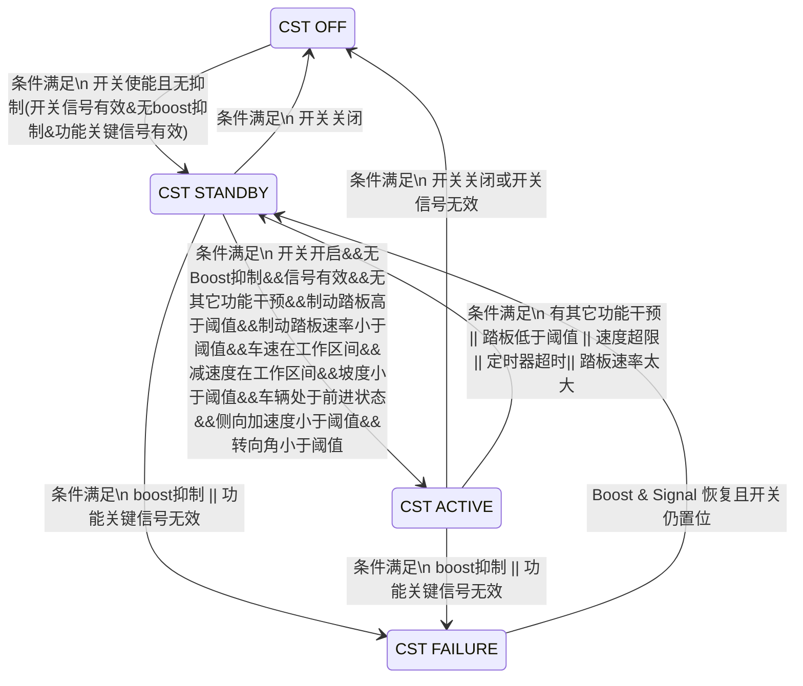

```mermaid

stateDiagram-v2
    state "CST OFF" as OFF
    state "CST STANDBY" as STANDBY
    state "CST ACTIVE" as ACTIVE
    state "CST FAILURE" as FAILURE

    OFF --> STANDBY: 条件满足\n 开关使能且无抑制(开关信号有效&无boost抑制&功能关键信号有效)

    STANDBY --> ACTIVE: 条件满足\n 开关开启&&无Boost抑制&&信号有效&&无其它功能干预&&制动踏板高于阈值&&制动踏板速率小于阈值&&车速在工作区间&&减速度在工作区间&&坡度小于阈值&&车辆处于前进状态&&侧向加速度小于阈值&&转向角小于阈值
    STANDBY --> OFF: 条件满足\n 开关关闭
    STANDBY --> FAILURE: 条件满足\n boost抑制 || 功能关键信号无效

    ACTIVE --> OFF: 条件满足\n 开关关闭或开关信号无效
    ACTIVE --> FAILURE: 条件满足\n boost抑制 || 功能关键信号无效
    ACTIVE --> STANDBY: 条件满足\n 有其它功能干预 || 踏板低于阈值 || 速度超限 || 定时器超时|| 踏板速率太大

    FAILURE --> STANDBY: Boost & Signal 恢复且开关仍置位

```